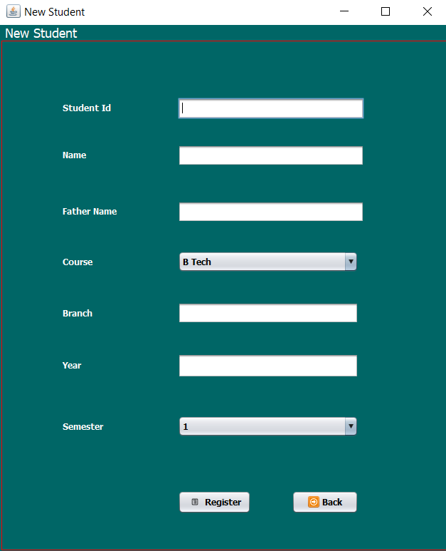
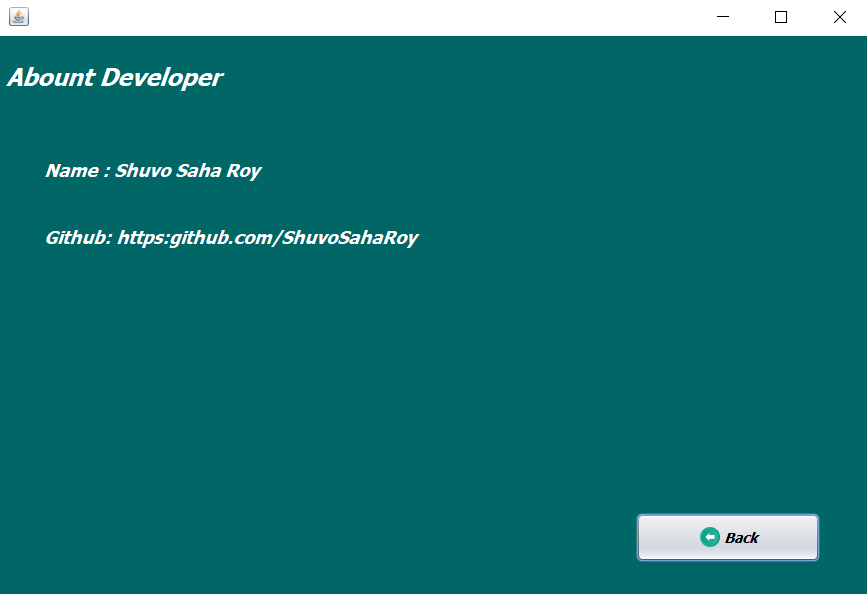

# JAVA swing project: Library Management Desktop APP

<!-- &nbsp; -->

I did this project for own learning purpose.

# Features
* CRUD - create, read, update, delete operation with search option
* JDBC
* Desktop app with java swing
* Nice and easy to use with a suitable view.
* Sqlite database system
* Password recovery

# Screenshots
> Login page

After running this project this login window will pop up.
Use 'a' as username and  123 as password.

Here users can signup and can retrieve forgotten password.

After successful login user progress bar will open

> Dashboard

From here, you can perform all operations like CRUD & search

> Add new book

> Add new students

> Issue a Book

> Return a Book

>Keep track of books

> Developed By

# Requirements and Tools:
I did this project on Netbeans IDE.

You check this on your side. But You need to add three jar file.

* jcalendar-1.4.jar
* sqlite-jdbc.jar
* rs2xml.jar

Just go to project properties of Netbeans > Libraries > Add Jar/folder. That's it. 👍

Don't forget to resolve those issue by adding jar files.

The zip file contains the whole project that can be easily implemented.

# <a href="https://github.com/ShuvoSahaRoy/java-project-library-management" ><strong>Project link</strong> </a>

---

<strong>made by Shuvo Saha Roy with 💕 and 🤘</strong>
